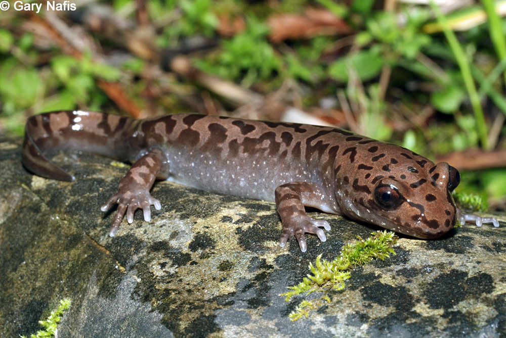

#### This doc has Aud's edits on intro, data, references, photos etc that need to be copy and pasted into the overall doc where the statistical changes were made 
(had to make new rmarkdoc b/c was one commit ahead of master)
```{r setup, include=FALSE}
knitr::opts_chunk$set(echo = FALSE,
                      message = FALSE,
                      warning = FALSE, 
                      cache = FALSE)
```

```{r}
# attach packages
library(tidyverse)
library(janitor)
library(plotly)
library(kableExtra)
library(dplyr)
library(here)
library(ggbeeswarm)
library(car)
library(plotly)
library(effsize)

# read in data
mack_raw <- read_csv("mack_creek_vertebrates.csv") %>% 
  clean_names() %>% 
  filter(species == "DITE") %>% 
  select(-pitnumber, -length2, -notes)

```


Pacific Giant Salamander Image Source: Gary Nafis^[1](http://www.californiaherps.com/salamanders/images/dtenebrosusfchu3086.jpg)^

### Introduction
(! this syntax is SoOoO STALE, HALP ! (but the info is good))

Pacific Giant Salamanders,(*Dicamptodon tenebrosus*) are the largest terrestrial salamander in North America, growing up to 13 inches in total length ^[2](http://www.californiaherps.com/salamanders/pages/d.tenebrosus.html)^. Pacific Giant Salamanders(PGS) populations range from northern California to the Canadian border, but are absent from the Olympic Peninsula. Thier habitats consist of wetlands such as permanent rivers, streams, creeks and pools of forests^[3](https://www.iucnredlist.org/species/59081/78906025#habitat-ecology)^.  PGS populations may be affected by increases in pressures associated with logging such as habitat destruction and increased silt in the water due to upstream disturbances. This report analyses the differences in PGS populations between old growth(OG) forests and clear cut (CC) forests located in the H.J. Andrews Experimental Forest near Blue River, Oregon. 

.jpg)
Map Source: Oregon State University^[4](https://andrewsforest.oregonstate.edu/data/map)^

---

### Data and Methods

The data^[5](https://doi.org/10.6073/pasta/5de64af9c11579266ef20da2ff32f702)^ analyzed for this report was collected from Mack Creek in the H.J. Andrews Experimental Forest in Oregon. Cuttthroat trout (Onchorhyncus clarki clarki) populations have been monitored since 1987 then monitoring of Pacific Giant Salamanders began in 1993. H.J. Andrews Experimental Forest contains two sections of clearcut forest (cleared in 1963) and an upstream 500 year old coniferous forest^[5](https://doi.org/10.6073/pasta/5de64af9c11579266ef20da2ff32f702)^. These two sections will be referred to as "clear cut"(CC) and "old growth"(OG) throughout this report. 

Specimen were sampled via electro-fishing and captured vertebrates were measured and weighed. This report uses the salamander data regarding section (old growth or clearcut), channel-specification (cascades, pool or side-channel), salamander weight (grams), and the total salamander counts observed(n). 

Salamander abundance across locations was explored using statistical tests including a chi-squared test, two-sample t-test, Cohen's d, Levene's test, one-way ANOVA, and Tukey's test.

---

### Results
#### Results A: 

Describe the trends in graph (in text). 

Figure 1 shows the overall trend of PGS population counts being lower in clear-cut ares when compared to counts from old-growth forest. The annual change, growth or declines, of the two populations follows the same trend. Between the years 2011 and 2014 there was an obvious decline in population of both sections. This decline in population may be due to....  


```{r}
# Note: Pacific Giant Salamanders, Dicamptodon tenebrosus (DITE).

# wrangle data - total annual counts of DITE for OG and CC for all years.

counts_dite <- mack_raw %>% 
  group_by(year, species, section) %>%
  summarize(counts = sum(entity))

# elongating abbreviations for legend 
counts_dite$section <- gsub("CC", "Clear cut", counts_dite$section)
counts_dite$section <- gsub("OG", "Old growth", counts_dite$section)

# make graph - show changes in annual counts for sections over time.
# graph additions - caption + aesthetic formatting.

dite_counts_line <- ggplot(counts_dite, aes(x = year, y = counts, group = section, color = section))+
  geom_line()+
  theme_minimal() + 
  labs(title = "Figure 1: Pacific Giant Salamander Counts in Old Growth\nand Clear Cut Sections of Mack Creek(1993-2017)", 
       x = "Year", 
       y = "Salamander Count (n)", 
       caption = "Figure 1 displays the total annual PGS counts for\nold-growth and clear-cut sections of Mack Creek.") + 
  scale_x_continuous(limits = c(1993,2017), 
                     breaks = c(1995, 2000, 2005, 2010, 2015))

dite_counts_line

```

---

#### Results B: 

really rough analysis: 
Table 1 shows that in both clear-cut and old-growth sections, salamanders are primarily located in channels classified as cascades(over 60% relative abundance), followed by side-channels then the least amount of salamanders were found in pools. Total annual counts of each  populaiton show that more salamanders were found in the clear-cut section of the forest. 


```{r}
# Note: I = riffle, IP = Isolated pools, 

# wrangle data - for DITE counts in diff channels in 2017.
channel_section <- mack_raw %>%
  filter(year == "2017", 
         unittype!="IP") %>% 
  group_by(unittype, section) %>%
  summarize(counts = sum(entity)) %>% 
  pivot_wider(names_from = unittype, values_from = counts) %>% 
  rename("Section" = section,
         "Cascades" = C,
         "Pool" = P,
         "Side-channel" = SC)

# mutate df - to get proportions of counts per channel.
channel_section_props <- channel_section %>% 
  adorn_percentages((denominator = "row")) %>% 
  adorn_pct_formatting(digits = 0) %>% 
  adorn_ns(position = "front")

# make table - of counts + proportions of DITE per channel in 2017.
kable(channel_section_props, 
      caption = "Table 1 [displays] the 2017 salamander counts in each section and the relative proportions of salamanders in each channel classification(cascade, pool or side-channel)") %>% 
  kable_styling("striped")


```

---

#### Results C: 
_Question_: Is there a significant difference in where in the channel PGS are located between the two sections? 

- Report in text (in context of actual counts), referencing table from Part B

```{r}
# chi-square test
chi_dite <- channel_section %>% 
  select(-Section)

dite_chi_test <- chisq.test(chi_dite)

```

Forest section (clear cut or old growth) does not have a significant effect on salamander location (cascades, pool, or side channel) ($\chi$^2^(`r dite_chi_test$parameter`) = `r round(dite_chi_test$statistic,2)`, *p* = `r round(dite_chi_test$p.value, 2)`).

---

#### Results D:

_Question:_ Is there a significant difference in mean weights for Pacific giant salamanders observed in the two forest sections (clear cut and old growth) in 2017? 

_Answer:_
In 2017...

- There **is not** a significant difference in **mean** weights for Pacific giant salamanders observed in the two forest sections (clear cut and old growth).
- There **IS** a significant difference in **median** weights for PGS between the two forest sections.


The two sections of forest in 2017 have overall salamander counts that differ by only 40 individual specimen. Pacific Giant Salamander mean wieght is 0.66 grams highers in clear cut forest sections than in old growth sections (5.43 and 4.77 grams, respectively). 

- mean weight of DITE in clear cut forest sections is 0.66 grams higher than in old growth sections (5.43 and 4.77 respectively).
- similar counts in the two forest sections: 368 at CC, 328 at OG (40 indiv diff).

```{r}
# wrangle data - for 2017, find dite counts + median, mean, sdev for dite weights.
weight_dite <- mack_raw %>% 
  filter(year == "2017",
         unittype != "IP") %>% 
  select(section, weight, unittype) %>% 
  group_by(section) %>% 
  mutate(weight_avg = mean(weight, na.rm = TRUE))

weight_section <- mack_raw %>% 
  filter(year == "2017",
         unittype != "IP") %>% 
  group_by(section) %>% 
  summarize(median_weight = median(weight, na.rm = TRUE),
            mean_weight = round(mean(weight, na.rm = TRUE), digits = 2),
            sdev = round(sd(weight, na.rm = TRUE), digits = 2),
            count = sum(entity))

# make table - showing summary stats for weights dependent on forest sections.
weight_section_table <- kable(weight_section) %>% 
  kable_styling(position = "center", 
                full_width = F)

weight_section_table

# wrangle data - for 2017, find dite counts + median, mean, sdev for dite weights.
weights_cc <- mack_raw %>% 
  filter(year == "2017",
         section == "CC",
         unittype != "IP") %>% 
  group_by(section)

weights_og <- mack_raw %>% 
  filter(year == "2017",
         section == "OG",
         unittype != "IP") %>% 
  group_by(section)


# Is there a significant difference in mean weights for Pacific Giant Salamanders observed in the two forest sections in 2017? 

weight_section_ttest <- t.test(weights_cc$weight, weights_og$weight)
# p = 0.1378

weight_section_cohen <- cohen.d(weights_cc$weight, weights_og$weight, na.rm = TRUE)
# d = 0.11

## graph for distribution of salamander weights for each section 

ggplot(weight_dite, aes(weight, fill = section)) +
  geom_density(alpha = 0.25) +
  scale_x_continuous(limits = c(-1, 90)) +
  scale_y_continuous(expand = c(0,0),
                     limits = c(0, 0.11)) +
  geom_vline(aes(xintercept = weight_avg,
                 color = section),
             linetype = "dashed") +
  labs(x = "Salamander Weight (g)",
       y = "Salamander Density",
       title = "Figure 2: Distribution of Salamander Weight in 2017",
       caption = "Fig. 2 shows the distribution of salamander weight in clear cut and old growth forest sections of Mack creek in 2017.\nDashed lines indicate mean  weight of  salamanders observed in each forest section.") +
  theme_bw()+
  theme(legend.position = "top",
        plot.caption = element_text(hjust = 0))

```

Mean salamander weights for clear cut (`r round(weight_section_ttest$estimate[1],2)`) and old growth (`r round(weight_section_ttest$estimate [2],2)`) forest sections do not differ significantly (t(`r round(weight_section_ttest$parameter,2)`) = (`r round(weight_section_ttest$statistic,2)`, *p* = (`r round(weight_section_ttest$p.value,3)`).

---

#### Results E:

Compare weights of Pacific giant salamanders in pools, cascades and side-channels of Mack Creek in 2017. Pool salamander observations from both the old growth and clear cut sections for this part (i.e., you will not consider “section” as a factor here).

First, visually compare Pacific giant salamander weights between the three channel classifications. You can choose how to best visualize the weights between the three groups (Beeswarm? Jitter? Histogram? Density? Something else?), but you should indicate values for the mean, and standard deviation, standard error or a 95% confidence interval. Add a figure caption. 

```{r}
weight_channel <- mack_raw %>% 
  filter(year == "2017",
         species == "DITE",
         unittype != "IP") %>%
  group_by(unittype)
         

weight_channel_summary <- weight_channel %>% 
  summarize(
    mean_weight = mean(weight, na.rm = TRUE),
    sd_weight = sd(weight, (na.rm = TRUE)),
    sample_size = n(),
    se_weight = sd((weight) / sqrt(n()), (na.rm = TRUE)),
    var_weight = var(weight, na.rm = TRUE)
  )

# elongating abbreviations for legend
# weight_channel$unittype <- gsub("SC", "Side-channel", weight_channel$unittype)
# weight_channel$unittype <- gsub("P", "Pool", weight_channel$unittype)
# weight_channel$unittype <- gsub("C", "Cascade", weight_channel$unittype)
# weight_channel$unittype <- gsub("SC", "Side-channel", weight_channel$unittype)
# weight_channel$unittype <- gsub("P", "Pool", weight_channel$unittype)
# weight_channel$unittype <- gsub("C", "Cascade", weight_channel$unittype)

# Beeswarm 
ggplot(data = weight_channel_summary,
       aes(x = unittype,
           y = mean_weight)) +
  geom_beeswarm(data = weight_channel,
                aes(x = unittype, y = weight, color = unittype),
                show.legend = FALSE)+
  geom_errorbar(data = weight_channel_summary,
                mapping = aes(ymin = mean_weight - sd_weight,
                              ymax = mean_weight + sd_weight),
                width = 0.1)+
  geom_point(data = weight_channel_summary,
             size = 2,
             aes(x = unittype,
                 y = mean_weight),
             color = "black")+ 
  labs(title = "Figure 2: Distribution of Pacific Giant Salamander weights across each location-classification", 
       caption = "Figure 2 illustrates the distribution of Salamander weights across each channel classification, regardless of clear cut or old-growth forest.", 
       x = "Channel Classification", 
       y = "Salamander Weight (grams)")+
  coord_flip()+
  theme_bw()+
  scale_y_continuous(expand = c(0,0),
                     limits = c(-5, 87.5),
                     breaks = c(0, 25, 50, 75))

```

Second, answer: Is there a significant difference in mean weights for Pacific giant salamanders observed in pools vs. cascades vs. side-channels in 2017? Describe the results of your statistical analysis in text, within the context of broader (and more important) measures of differences between groups (some options: means differences, effect sizes, percent differences, etc). 

```{r}
weight_channel_summary <- weight_channel %>% 
  summarize(
    mean_weight = mean(weight, na.rm = TRUE),
    sd_weight = sd(weight, (na.rm = TRUE)),
    sample_size = n(),
    se_weight = sd((weight) / sqrt(n()), (na.rm = TRUE)),
    var_weight = var(weight, na.rm = TRUE))

kable(weight_channel_summary) %>% 
  kable_styling()

```

```{r, include = FALSE}
# Levene's test 

# Importantly, variances are SOMEWHAT close (largest is < 4x greater than the smallest)
# But we can perform a Levene's Test for equal variances anyway: 

leveneTest(weight ~ unittype, data = weight_channel)

```


```{r, include = FALSE}
# One-way ANOVA

weight_aov <- aov(weight ~ unittype, data = weight_channel)

summary(weight_aov)

# We retain the alternative hypothesis (mean weight for the 3 species are NOT the same). But are they all different from each other? Or just two? 

weight_lm <- lm(weight ~ unittype, data = weight_channel)
weight_aov_t3 <- Anova(weight_lm)

weight_aov_t3

## Anova Table (Type II tests)
## 
## Response: flipper_length_mm
##            Sum Sq  Df F value    Pr(>F)    
## species   21415.6   2  411.79 < 2.2e-16 ***
## Residuals  4212.6 162                      
## ---
## Signif. codes:  0 '***' 0.001 '**' 0.01 '*' 0.05 '.' 0.1 ' ' 1
# Notice that the F statistic value here (411.79) is almost exactly the same - the difference between these two is minimal. 

```

```{r, include = FALSE}

TukeyHSD(weight_aov)

```
Third, describe any concerns you have about comparing means across the groups. What might be another option to consider moving forward with the analysis? (You don’t need to actually do that here, just describe briefly in 1-2 sentences.)
- Using means to compare groupd lead to skewed data, as seen in Figure 2, there were many outliers in the weights of salamanders within each channel section. For data that contains outliers, comparing medians elimanates the skew and allows for more [equal, levelized, ] comparison among groups. 
"Panulirus interruptus; California Spiny Lobster." CalPhotos, University of California, Berkeley, 1999, https://calphotos.berkeley.edu/cgi/img_query?enlarge=9092+3191+3541+0006


--- 
### References
1. "Dicamptodon tenebrosus; Pacific Giant Salamander." Gary Nafis, California Herps,
http://www.californiaherps.com/salamanders/images/dtenebrosusfchu3086.jpg

2. "Coastal Giant Salamander - Dicamptodon tenebrosus." California Herps, 2019, 
http://www.californiaherps.com/salamanders/pages/d.tenebrosus.html

3. "Coastal Giant Salamander - Dicamptodon tenebrosus." IUCN Red List of Threatened Species, 2015,
https://www.iucnredlist.org/species/59081/78906025#habitat-ecology

4. "Andrews Forest Map" HJ Andrews Experimental Forest Long-Term Ecological Research, 2017, 
https://andrewsforest.oregonstate.edu/data/map 

5. Gregory S. V. 2016. Aquatic Vertebrate Population Study in Mack Creek, Andrews Experimental Forest, 1987 to present. Environmental Data Initiative. https://doi.org/10.6073/pasta/5de64af9c11579266ef20da2ff32f702. Dataset accessed 12/01/2019.


